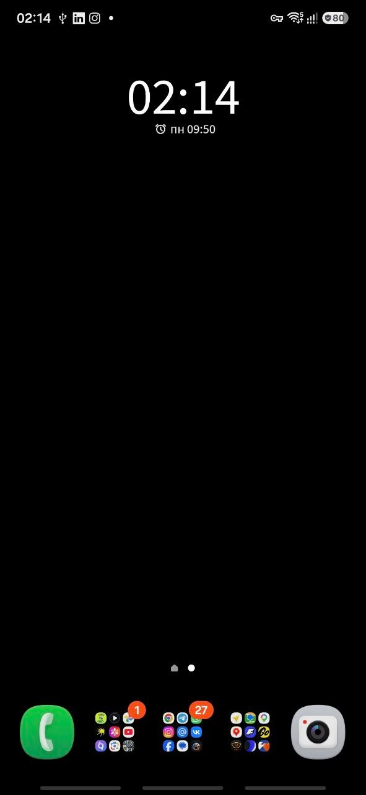
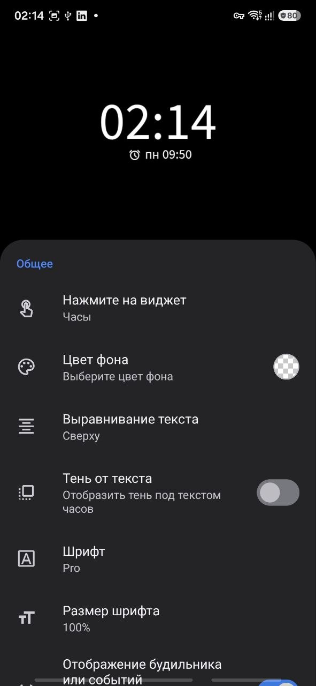
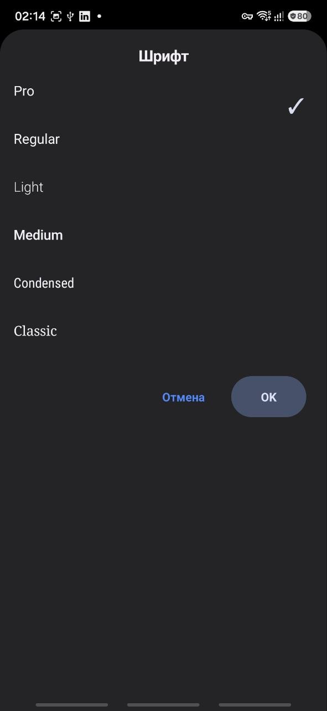
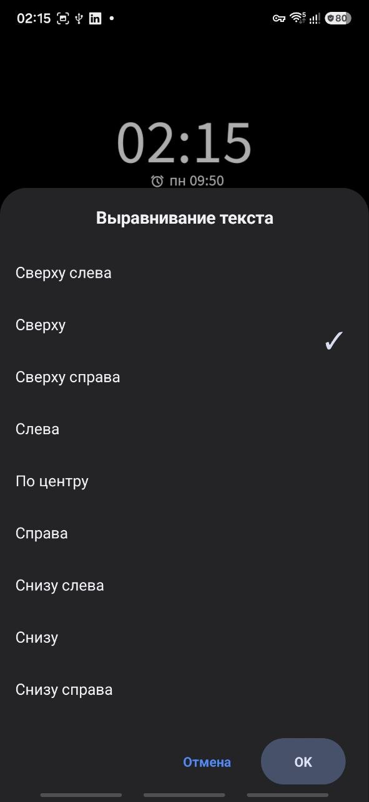

# Samsung Alarm Clock Widget by Zucker

[](https://github.com/EvgenyZucker/Samsung-Alarm-Clock-Widget-by-Zucker/releases/latest/download/Samsung-Alarm-Clock-Widget-by-Zucker-v1.1.apk)
[](https://github.com/EvgenyZucker/Samsung-Alarm-Clock-Widget-by-Zucker/releases/latest)
[](https://github.com/EvgenyZucker/Samsung-Alarm-Clock-Widget-by-Zucker/actions/workflows/android-ci.yml)

[Changelog](CHANGELOG.md)

> [!IMPORTANT]
> After installing the APK, two system permissions must be granted once through ADB. Root is not required, and the permissions survive normal phone restarts. Follow the [detailed installation and setup instructions](#detailed-installation-and-setup) below.

This application was developed for personal use because I could not find a single widget that displayed the actual next Samsung alarm correctly without that alarm being overridden by system events, Modes and Routines, calendar events, or other scheduled Android activities.

The application was independently implemented after observing the publicly visible behavior and interface of **Digital Clock Widget** by **Maize / EZI Studio Inc.** (`com.maize.digitalClock`, version 6.2.1), available as “Digital Clock Widget” in One UI. It does not use or include that application's source code or proprietary assets. The widget recreates its general layout, customization options and user experience while using an entirely different algorithm to determine the next alarm.

Unlike widgets that rely only on Android's standard `getNextAlarmClock()` result, this widget analyzes Samsung Clock alarm data and filters out unrelated scheduled system events. This makes it possible to display the actual next alarm created in Samsung Clock, even when Samsung Modes and Routines or other Android services have scheduled earlier events.

## Screenshots

<p align="center">
  
  &nbsp;
  
  &nbsp;
  
</p>

<p align="center">
  
  &nbsp;
  
</p>

<p align="center"><sub>Samsung Galaxy S25 FE running One UI 8.5. Interface language follows the device settings.</sub></p>

## Features

- Displays the current time and date.
- Displays the actual next alarm from Samsung Clock.
- Filters out unrelated system events and Modes and Routines schedules.
- Automatically updates when the alarm changes.
- Continues working after the phone is restarted.
- Opens Samsung Clock or another selected application when the widget is tapped.
- Supports configurable time and date formats.
- Supports custom colors for the time, date, alarm and background.
- Provides multiple fonts, text sizes and alignment options.
- Supports configurable time zones.
- Includes an optional text shadow.
- Can be reconfigured through the widget's long-press menu.
- Includes an adaptive launcher icon, a monochrome themed icon and a native widget preview.
- Provides English and Russian interfaces with per-app language selection on supported Android versions.
- Detects missing ADB permissions and provides status checks and copyable setup commands in the application.
- Includes an About and legal screen with version, repository and license information.
- Does not require root or Shizuku.

## Tested devices

The current development build has been tested on:

| Device | One UI | Samsung Clock | Result | Notes |
|---|---|---|---|---|
| Samsung Galaxy S25 FE | 8.5 | `com.sec.android.app.clockpackage` | Fully verified | Development device; Russian and English UI, themed icon and in-place updates tested |

The application targets Android SDK 36. Testing on other Samsung devices and One UI versions is welcome.

The following behavior was verified on the device:

- correct detection of the next Samsung Clock alarm;
- filtering of earlier events created by Samsung Modes and Routines;
- support for repeating alarms scheduled several days ahead;
- automatic widget updates after changing an alarm;
- correct operation after restarting the phone;
- preservation of the required permissions after a restart;
- opening Samsung Clock by tapping the widget;
- widget resizing and reconfiguration through the One UI launcher;
- operation without root, Shizuku or a permanently connected computer.

### Compatibility report template

When reporting a successful test or a problem, please include:

```text
Device model:
Android version:
One UI version:
Samsung Clock version:
Application version:
Installation type: fresh install / update
DUMP permission: granted / not granted
PACKAGE_USAGE_STATS permission: granted / not granted
GET_USAGE_STATS AppOp: allow / deny
Next alarm shown correctly: yes / no
Widget updates after changing an alarm: yes / no
Samsung Clock opens when the widget is tapped: yes / no
Additional details:
```

## Important setup requirement

Due to Android security restrictions, a regular third-party application cannot obtain the system access required to inspect Samsung Clock alarms automatically.

After installing the APK, the user must grant two permissions once through ADB:

```powershell
adb shell pm grant --user 0 dev.local.samsungalarmwidget android.permission.DUMP
adb shell pm grant --user 0 dev.local.samsungalarmwidget android.permission.PACKAGE_USAGE_STATS
adb shell appops set --user 0 dev.local.samsungalarmwidget GET_USAGE_STATS allow
```

Root access is not required. The permissions remain active after restarting the phone, and the computer is not needed for normal operation after the initial setup.

If the application is uninstalled, the permissions are removed and must be granted again. Installing an update over the existing version preserves them.

## Detailed installation and setup

### 1. Install the APK

1. Download the latest APK from the project's [Releases](https://github.com/EvgenyZucker/Samsung-Alarm-Clock-Widget-by-Zucker/releases) page.
2. Open the downloaded APK on the Samsung phone.
3. If Android asks for permission to install unknown applications, allow it for the application used to open the APK.
4. Complete the installation, but do not add the widget yet.

### 2. Enable Developer options and USB debugging

1. On the phone, open **Settings → About phone → Software information**.
2. Tap **Build number** seven times.
3. Confirm the phone's PIN or password when requested.
4. Return to the main Settings screen.
5. Open **Developer options**.
6. Enable **USB debugging**.

### 3. Download Android Platform Tools

1. Download the official [Android SDK Platform Tools](https://developer.android.com/tools/releases/platform-tools) for your operating system.
2. Extract the archive to a convenient directory, for example `C:\platform-tools`.
3. Open the extracted `platform-tools` directory in File Explorer.
4. Click the address bar, type `powershell`, and press Enter.

### 4. Connect and authorize the phone

1. Connect the unlocked phone to the computer with a USB data cable.
2. Run:

   ```powershell
   .\adb.exe devices
   ```

3. Confirm **Allow USB debugging** on the phone. You may enable **Always allow from this computer**.
4. Run `.\adb.exe devices` again. The device should be listed with the status `device`.

If the status is `unauthorized`, unlock the phone and accept the USB debugging request. If no device appears, try another USB cable or USB port and make sure the cable supports data transfer.

### 5. Grant the required permissions

Run these commands one at a time:

```powershell
.\adb.exe shell pm grant --user 0 dev.local.samsungalarmwidget android.permission.DUMP
.\adb.exe shell pm grant --user 0 dev.local.samsungalarmwidget android.permission.PACKAGE_USAGE_STATS
.\adb.exe shell appops set --user 0 dev.local.samsungalarmwidget GET_USAGE_STATS allow
```

No output after a command normally means that it completed successfully.

### 6. Verify the permissions

Run:

```powershell
.\adb.exe shell dumpsys package dev.local.samsungalarmwidget | findstr /i "DUMP PACKAGE_USAGE_STATS"
.\adb.exe shell appops get --user 0 dev.local.samsungalarmwidget GET_USAGE_STATS
```

For the main phone profile (`user 0`), both permissions should show `granted=true`, and `GET_USAGE_STATS` should show `allow`.

Some Samsung phones may also show `granted=false` for another profile, such as `userId=150`. This normally belongs to Secure Folder or another protected Samsung profile and does not affect operation in the main profile.

### 7. Restart the application

Run:

```powershell
.\adb.exe shell am force-stop dev.local.samsungalarmwidget
```

Disconnect the phone from the computer and open **Samsung Alarm Clock Widget by Zucker** from the application list.

### 8. Add and configure the widget

1. Long-press an empty area of the One UI home screen.
2. Select **Widgets**.
3. Find **Samsung Alarm Clock Widget by Zucker**.
4. Add the widget to the home screen.
5. Configure its appearance and tap action.
6. Create or change an alarm in Samsung Clock and allow the widget a few minutes to refresh.

After this initial setup, the computer is no longer required. The permissions survive normal phone restarts.

The application also shows the current permission state under **Permissions**. If access is missing, tap the warning to view and copy the required ADB commands.

### Updating the application

Install a new APK over the existing application. Do not uninstall the old version first. Updating in place preserves the ADB permissions; uninstalling the application removes them and requires the setup commands to be run again.

> [!WARNING]
> Version 1.0 was distributed with a temporary debug signature. To migrate from public version 1.0 to version 1.1, uninstall version 1.0 once, install version 1.1, and grant the ADB permissions again. Starting with version 1.1, releases use a permanent production signing key and future updates can be installed in place.

## Compatibility

The application is designed specifically for Samsung devices using the standard **Samsung Clock** application:

```text
com.sec.android.app.clockpackage
```

Samsung may change the internal representation of alarms in different devices or future One UI releases. Therefore, compatibility outside the tested Samsung Galaxy S25 FE running One UI 8.5 cannot currently be guaranteed.

The application is not intended to read alarms created in third-party clock applications.

## Troubleshooting

### `adb` is not recognized

Run ADB from the extracted Android Platform Tools directory using `./adb` on macOS/Linux or `.\adb.exe` on Windows. If Android Studio installed the SDK in its default Windows location, the command may also be run with the full path:

```powershell
& "$env:LOCALAPPDATA\Android\Sdk\platform-tools\adb.exe" devices
```

Alternatively, add the `platform-tools` directory to the system `PATH`.

### The device is `unauthorized`

Unlock the phone and accept the **Allow USB debugging** prompt. If the prompt does not appear:

1. Disconnect and reconnect the USB cable.
2. In Developer options, select **Revoke USB debugging authorizations**.
3. Run `adb devices` again and accept the new prompt.

### The phone does not appear in `adb devices`

- Use a USB cable that supports data transfer, not charging only.
- Try another USB port and set the phone's USB mode to **File transfer**.
- Keep the phone unlocked.
- Confirm that USB debugging is enabled.
- On Windows, install or update the Samsung USB driver if necessary.

### A permission command fails

Confirm that the package is installed and that the command uses the exact package name `dev.local.samsungalarmwidget`. Run commands one at a time. On devices where usage access is controlled by an AppOp, run both the `pm grant` and `appops set` commands shown above.

Open the application after granting access and use **Permissions → Check permissions**. Reinstalling the application removes the grants; installing an update in place preserves them.

### Another profile shows `userId=150` or `granted=false`

Samsung Secure Folder and other protected profiles may use a secondary Android user such as `userId=150`. A denial for that profile is normally harmless when the widget is installed in the main `user 0` profile. Always verify `user 0` explicitly before troubleshooting another profile.

### No alarm is displayed

1. Confirm that an enabled future alarm exists in Samsung Clock.
2. Check the permissions inside the application.
3. Open Samsung Clock, change the alarm by one minute and save it.
4. Wait for the widget refresh or reconfigure the widget once.
5. Confirm that the alarm belongs to Samsung Clock rather than a third-party clock application.

The widget keeps the last valid alarm value when a temporary permission or diagnostic error occurs. This prevents a transient failure from immediately clearing a correct alarm.

### Samsung Clock does not open

Confirm that Samsung Clock is installed and enabled. In the widget settings, open **Tap the widget** and select Samsung Clock again. The application displays an error message when the Samsung Clock launch activity cannot be found.

### Updating fails with a signature error

Public version 1.0 used a temporary debug signature and must be uninstalled before installing 1.1 or newer. Releases starting with 1.1 share the permanent production signature and should be installed over the existing application without uninstalling it.

## Privacy

The widget works locally on the device.

- It does not require an account.
- It does not contain advertising.
- It does not transmit alarm information to external servers.
- It does not use analytics or tracking.
- It does not require an internet connection for normal operation.

The `DUMP` and usage-statistics permissions are used only to locate and identify the next alarm scheduled by Samsung Clock.

## Building from source

The project requires Android SDK 36 and a compatible JDK. To create an optimized release APK:

```powershell
.\gradlew.bat clean assembleRelease
```

The APK is generated at `app/build/outputs/apk/release/app-release.apk`.

> Release builds require a private `keystore.properties` file and are signed with the project's permanent production key. The signing key and passwords are intentionally excluded from this repository.

Every push and pull request is checked by GitHub Actions using `lintDebug`, `testDebugUnitTest` and `assembleDebug`. CI builds only the debug variant, receives no production-signing secrets and does not publish APK files.

## License

The project is licensed under the [Apache License 2.0](LICENSE).

It includes icons derived from Google Material Icons and Material Symbols,
which are also licensed under Apache License 2.0. See
[Third-party notices](THIRD_PARTY_NOTICES.md) for details.

## Disclaimer

This is an independent, unofficial project developed for personal use.

It is not affiliated with, endorsed by, or sponsored by Samsung Electronics, Maize, or EZI Studio Inc. Samsung, Samsung Clock, One UI, and other product names are trademarks of their respective owners.

The project does not contain source code from Digital Clock Widget. Its interface and available settings were independently recreated based on publicly visible behavior and testing of the installed application.

## Developer

EvgenyZucker
