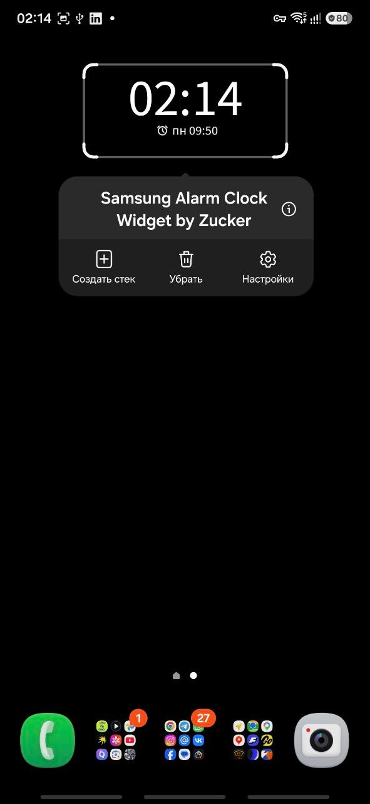

# Samsung Alarm Clock Widget by Zucker

> **Язык:** Русский · [English documentation](README.md)

[](https://github.com/EvgenyZucker/Samsung-Alarm-Clock-Widget-by-Zucker/releases/latest/download/Samsung-Alarm-Clock-Widget-by-Zucker-v1.2.0.apk)
[](https://github.com/EvgenyZucker/Samsung-Alarm-Clock-Widget-by-Zucker/releases/tag/v1.2.0)
[](https://github.com/EvgenyZucker/Samsung-Alarm-Clock-Widget-by-Zucker/actions/workflows/android-ci.yml)

[История изменений](CHANGELOG.md) · [Участие в разработке](CONTRIBUTING.md) · [Безопасность](SECURITY.md) · [Поддержка](#поддержка-и-обратная-связь)

> [!IMPORTANT]
> После установки APK необходимо один раз выдать приложению два системных разрешения через ADB. Root не требуется, а разрешения сохраняются после обычной перезагрузки телефона. Следуйте [подробной инструкции по установке и настройке](#подробная-установка-и-настройка).

Это приложение было создано для личного использования, поскольку мне не удалось найти виджет, который корректно показывал бы именно следующий будильник Samsung, не подменяя его системными событиями, сценариями «Режимы и сценарии», событиями календаря и другими запланированными действиями Android.

Приложение реализовано независимо после изучения общедоступного поведения и интерфейса **Digital Clock Widget** от **Maize / EZI Studio Inc.** (`com.maize.digitalClock`, версия 6.2.1), доступного в One UI под названием Digital Clock Widget. Исходный код и проприетарные ресурсы этого приложения не использовались и не включены в проект. Виджет воспроизводит общую компоновку, возможности настройки и пользовательский опыт, но использует совершенно другой алгоритм определения следующего будильника.

В отличие от виджетов, которые используют только стандартный результат Android `getNextAlarmClock()`, этот виджет анализирует данные будильников Samsung Clock и отфильтровывает посторонние системные события. Благодаря этому отображается настоящий следующий будильник, созданный в Samsung Clock, даже если Samsung Modes and Routines или другие службы Android запланировали более ранние события.

## Скриншоты

<p align="center">
  
  &nbsp;
  
  &nbsp;
  
</p>

<p align="center">
  
  &nbsp;
  
</p>

<p align="center"><sub>Samsung Galaxy S25 FE с One UI 8.5. Язык интерфейса соответствует настройкам устройства.</sub></p>

## Требования

- Устройство Samsung с Android 8.0 или новее.
- Стандартное приложение Samsung Clock (`com.sec.android.app.clockpackage`).
- Компьютер для однократной выдачи разрешений через ADB. Root и Shizuku не требуются.

После первоначальной настройки виджет работает без подключённого компьютера и без интернета.

## Возможности

- Отображение текущего времени и даты.
- Отображение настоящего следующего будильника из Samsung Clock.
- Фильтрация посторонних системных событий и расписаний «Режимов и сценариев».
- Автоматическое обновление после изменения будильника. При включённом экране подождите до двух минут: Android может группировать фоновую работу. При выключенном экране проверки откладываются и возобновляются сразу после его включения.
- Работа после перезагрузки телефона.
- Открытие Samsung Clock или другого выбранного приложения по нажатию на виджет.
- Настраиваемые форматы времени и даты, цвета, шрифты, размеры, выравнивание и часовые пояса.
- Дополнительная тень текста.
- Повторная настройка через меню долгого нажатия на виджет.
- Адаптивная launcher-иконка, монохромная тематическая иконка и нативное превью виджета.
- Интерфейс на русском и английском языках, включая выбор языка приложения на поддерживаемых версиях Android.
- Обнаружение отсутствующих ADB-разрешений, проверка их состояния и копирование команд настройки.
- Экран «О приложении и лицензии» с версией, ссылкой на репозиторий и сведениями о лицензиях.
- Работа без root и Shizuku.

## Проверенные устройства

Версия 1.2.0 проверена на следующем устройстве:

| Устройство | Android | One UI | Пакет Samsung Clock | Версия Samsung Clock | Результат | Примечания |
|---|---|---|---|---|---|---|
| Samsung Galaxy S25 FE | Не зафиксирована | 8.5 | `com.sec.android.app.clockpackage` | Не зафиксирована | Полностью проверено | Проверены русский и английский интерфейсы, тематическая иконка и обновление с 1.1 до 1.2.0 поверх установленной версии |

Приложение рассчитано на Android SDK 36. Приветствуются результаты проверки на других устройствах Samsung и версиях One UI.

На устройстве подтверждены: корректное определение следующего будильника; фильтрация более ранних событий Modes and Routines; повторяющиеся будильники на несколько дней вперёд; автоматическое обновление виджета; работа и сохранение разрешений после перезагрузки; открытие Samsung Clock; изменение размера и повторная настройка в One UI; работа без root, Shizuku и постоянно подключённого компьютера.

### Шаблон отчёта о совместимости

При сообщении об успешной проверке или проблеме укажите:

```text
Модель устройства:
Версия Android:
Версия One UI:
Версия Samsung Clock:
Версия приложения:
Тип установки: чистая установка / обновление
Разрешение DUMP: выдано / не выдано
Разрешение PACKAGE_USAGE_STATS: выдано / не выдано
AppOp GET_USAGE_STATS: allow / deny
Следующий будильник показан верно: да / нет
Виджет обновляется после изменения будильника: да / нет
Samsung Clock открывается по нажатию на виджет: да / нет
Дополнительные сведения:
```

## Важное требование к настройке

Из-за ограничений безопасности Android обычное стороннее приложение не может самостоятельно получить системный доступ, необходимый для чтения будильников Samsung Clock.

После установки APK один раз выполните через ADB:

```powershell
adb shell pm grant --user 0 dev.local.samsungalarmwidget android.permission.DUMP
adb shell pm grant --user 0 dev.local.samsungalarmwidget android.permission.PACKAGE_USAGE_STATS
adb shell appops set --user 0 dev.local.samsungalarmwidget GET_USAGE_STATS allow
```

Root не требуется. Разрешения сохраняются после перезагрузки телефона, а компьютер после первоначальной настройки больше не нужен. При удалении приложения разрешения удаляются; при обновлении поверх установленной версии они сохраняются.

## Подробная установка и настройка

### 1. Установите APK

1. Скачайте последнюю версию APK на странице [Releases](https://github.com/EvgenyZucker/Samsung-Alarm-Clock-Widget-by-Zucker/releases).
2. Откройте скачанный APK на телефоне Samsung.
3. Если Android запросит разрешение на установку неизвестных приложений, разрешите её для приложения, из которого открыт APK.
4. Завершите установку, но пока не добавляйте виджет.

### 2. Включите параметры разработчика и отладку по USB

1. Откройте **Настройки → Сведения о телефоне → Сведения о ПО**.
2. Семь раз нажмите **Номер сборки**.
3. При необходимости подтвердите PIN-код или пароль телефона.
4. Вернитесь на главный экран настроек и откройте **Параметры разработчика**.
5. Включите **Отладку по USB**.

### 3. Скачайте Android Platform Tools

1. Скачайте официальные [Android SDK Platform Tools](https://developer.android.com/tools/releases/platform-tools) для своей операционной системы.
2. Распакуйте архив, например в `C:\platform-tools`.
3. Откройте папку `platform-tools` в Проводнике.
4. Нажмите адресную строку, введите `powershell` и нажмите Enter.

### 4. Подключите и авторизуйте телефон

1. Подключите разблокированный телефон к компьютеру USB-кабелем с поддержкой передачи данных.
2. Выполните:

   ```powershell
   .\adb.exe devices
   ```

3. Подтвердите на телефоне запрос **Разрешить отладку по USB**. Можно включить **Всегда разрешать с этого компьютера**.
4. Повторно выполните `.\adb.exe devices`. Устройство должно отображаться со статусом `device`.

Если указан статус `unauthorized`, разблокируйте телефон и подтвердите запрос отладки. Если устройство отсутствует, попробуйте другой кабель или USB-порт и убедитесь, что кабель поддерживает передачу данных.

### 5. Выдайте необходимые разрешения

Выполните команды по одной:

```powershell
.\adb.exe shell pm grant --user 0 dev.local.samsungalarmwidget android.permission.DUMP
.\adb.exe shell pm grant --user 0 dev.local.samsungalarmwidget android.permission.PACKAGE_USAGE_STATS
.\adb.exe shell appops set --user 0 dev.local.samsungalarmwidget GET_USAGE_STATS allow
```

Отсутствие вывода обычно означает успешное выполнение команды.

### 6. Проверьте разрешения

```powershell
.\adb.exe shell dumpsys package dev.local.samsungalarmwidget | findstr /i "DUMP PACKAGE_USAGE_STATS"
.\adb.exe shell appops get --user 0 dev.local.samsungalarmwidget GET_USAGE_STATS
```

Для основного профиля телефона (`user 0`) оба разрешения должны иметь значение `granted=true`, а `GET_USAGE_STATS` — значение `allow`.

На некоторых телефонах Samsung может также отображаться `granted=false` для другого профиля, например `userId=150`. Обычно это Secure Folder или другой защищённый профиль Samsung; на работу приложения в основном профиле это не влияет.

### 7. Перезапустите приложение

```powershell
.\adb.exe shell am force-stop dev.local.samsungalarmwidget
```

Отключите телефон от компьютера и откройте **Samsung Alarm Clock Widget by Zucker** из списка приложений.

### 8. Добавьте и настройте виджет

1. Нажмите и удерживайте свободную область домашнего экрана One UI.
2. Выберите **Виджеты**.
3. Найдите **Samsung Alarm Clock Widget by Zucker**.
4. Добавьте виджет на домашний экран.
5. Настройте его внешний вид и действие по нажатию.
6. Создайте или измените будильник в Samsung Clock. При включённом экране подождите до двух минут. При выключенном экране проверка откладывается и выполняется сразу после его включения.

После этой настройки компьютер больше не нужен. Состояние разрешений доступно в разделе **Разрешения** приложения. Если доступа нет, нажмите предупреждение, чтобы посмотреть и скопировать необходимые ADB-команды.

### Обновление приложения

Устанавливайте новый APK поверх существующего приложения, не удаляя старую версию. Так сохраняются виджет, его настройки и выданные через ADB разрешения.

> [!WARNING]
> Версия 1.0 распространялась с временной debug-подписью. Для перехода с публичной версии 1.0 необходимо один раз удалить её, установить последний релиз и повторно выдать ADB-разрешения. Начиная с версии 1.1 используется постоянная production-подпись, поэтому последующие версии обновляются поверх.

## Совместимость

Приложение предназначено для устройств Samsung со стандартным приложением **Samsung Clock**:

```text
com.sec.android.app.clockpackage
```

Samsung может изменить внутреннее представление будильников на других устройствах или в будущих версиях One UI. Поэтому совместимость за пределами проверенного Samsung Galaxy S25 FE с One UI 8.5 пока не гарантируется. Будильники сторонних приложений часов не поддерживаются.

## Устранение проблем

### Команда `adb` не распознана

Запускайте ADB из распакованной папки Android Platform Tools: `./adb` в macOS/Linux или `.\adb.exe` в Windows. Если SDK установлен Android Studio в стандартную папку Windows, можно использовать полный путь:

```powershell
& "$env:LOCALAPPDATA\Android\Sdk\platform-tools\adb.exe" devices
```

Также можно добавить папку `platform-tools` в системную переменную `PATH`.

### Устройство имеет статус `unauthorized`

Разблокируйте телефон и подтвердите запрос **Разрешить отладку по USB**. Если запрос не появляется:

1. Отключите и снова подключите USB-кабель.
2. В параметрах разработчика выберите **Отозвать разрешения отладки по USB**.
3. Снова выполните `adb devices` и подтвердите новый запрос.

### Телефон отсутствует в `adb devices`

- Используйте кабель с поддержкой передачи данных, а не только зарядки.
- Попробуйте другой USB-порт и выберите на телефоне режим **Передача файлов**.
- Не блокируйте телефон.
- Убедитесь, что отладка по USB включена.
- В Windows при необходимости установите или обновите USB-драйвер Samsung.

### Команда выдачи разрешения завершается ошибкой

Убедитесь, что приложение установлено, а имя пакета указано точно: `dev.local.samsungalarmwidget`. Выполняйте команды по одной. Для доступа к статистике использования выполните обе команды `pm grant` и `appops set`, приведённые выше.

После выдачи доступа откройте приложение и выберите **Разрешения → Проверить разрешения**. Переустановка удаляет разрешения, обновление поверх установленной версии сохраняет их.

### Другой профиль показывает `userId=150` или `granted=false`

Samsung Secure Folder и другие защищённые профили могут использовать отдельного пользователя Android, например `userId=150`. Отказ для него обычно не имеет значения, если виджет установлен в основном профиле `user 0`. Всегда сначала проверяйте именно `user 0`.

### Будильник не отображается

1. Убедитесь, что в Samsung Clock включён будущий будильник.
2. Проверьте разрешения внутри приложения.
3. Откройте Samsung Clock, измените время будильника на одну минуту и сохраните его.
4. Оставьте экран включённым и подождите до двух минут. Android может отложить минутную фоновую проверку. Если экран был выключен, включите его для запуска отложенной проверки.
5. Убедитесь, что будильник создан в Samsung Clock, а не в стороннем приложении.

При временной ошибке разрешений или диагностики виджет сохраняет последнее корректное значение, чтобы кратковременный сбой не удалял настоящий будильник.

### Samsung Clock не открывается

Убедитесь, что Samsung Clock установлен и включён. В настройках виджета откройте **Нажмите на виджет** и снова выберите Samsung Clock. Если приложение не может найти экран запуска Samsung Clock, оно показывает сообщение об ошибке.

### Обновление завершается ошибкой подписи

Публичная версия 1.0 использовала временную debug-подпись, поэтому перед установкой версии 1.1 или новее её необходимо удалить. Все релизы начиная с 1.1 используют одну постоянную production-подпись и устанавливаются поверх предыдущей версии.

## Конфиденциальность

Виджет работает локально на устройстве:

- не требует учётной записи;
- не содержит рекламы;
- не передаёт сведения о будильниках на внешние серверы;
- не использует аналитику или отслеживание;
- не требует интернета для обычной работы.

Разрешения `DUMP` и доступа к статистике использования применяются только для поиска и определения следующего будильника Samsung Clock.

## Поддержка и обратная связь

- При проблемах с установкой или разрешениями начните с раздела [Устранение проблем](#устранение-проблем).
- Для воспроизводимой ошибки используйте [форму сообщения об ошибке](https://github.com/EvgenyZucker/Samsung-Alarm-Clock-Widget-by-Zucker/issues/new?template=bug_report.yml).
- Для результатов проверки устройства используйте [форму отчёта о совместимости](https://github.com/EvgenyZucker/Samsung-Alarm-Clock-Widget-by-Zucker/issues/new?template=compatibility_report.yml).
- Перед изменением кода прочитайте [CONTRIBUTING.md](CONTRIBUTING.md).
- О предполагаемых уязвимостях сообщайте приватно согласно [SECURITY.md](SECURITY.md), а не через публичный issue.

Перед публикацией скриншотов или журналов удалите серийные номера устройств, личные названия будильников, пароли, материалы подписи и посторонние диагностические данные.

## Сборка из исходного кода

Требуются Android SDK 36 и совместимая версия JDK. Для создания оптимизированного release APK выполните:

```powershell
.\gradlew.bat clean assembleRelease
```

APK будет создан в `app/build/outputs/apk/release/app-release.apk`.

> Для release-сборки необходим приватный файл `keystore.properties` и постоянный production-ключ проекта. Ключ и пароли намеренно исключены из репозитория.

Каждый push и pull request проверяется GitHub Actions командами `lintDebug`, `testDebugUnitTest` и `assembleDebug`. CI собирает только debug-вариант, не получает секретов production-подписи и не публикует APK.

## Лицензия

Проект распространяется по [Apache License 2.0](LICENSE).

В проект включены производные от Google Material Icons и Material Symbols, также распространяемых по Apache License 2.0. Подробности приведены в [уведомлениях о сторонних компонентах](THIRD_PARTY_NOTICES.md).

## Отказ от ответственности

Это независимый неофициальный проект, созданный для личного использования. Он не связан с Samsung Electronics, Maize, EZI Studio Inc. или Google, не одобрен и не спонсируется ими. Samsung, Samsung Clock, One UI и другие названия продуктов являются товарными знаками соответствующих владельцев.

Проект не содержит исходного кода Digital Clock Widget. Интерфейс и доступные настройки были независимо воссозданы на основе общедоступного поведения и тестирования установленного приложения.

## Разработчик

EvgenyZucker
